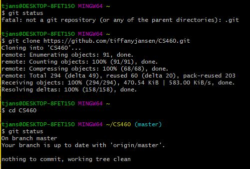
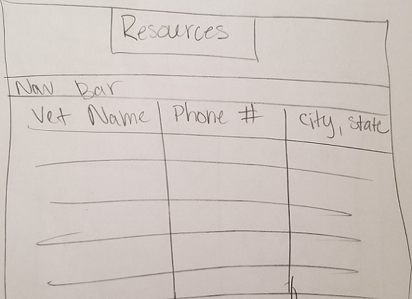
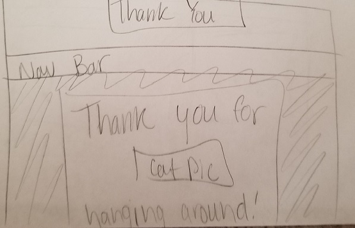
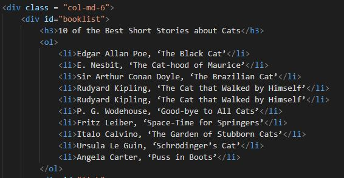

# Homework 1 Blog

### About the Assignment

When first looking at the assigment I was really scared it was going to take a super long time, but once I got started everything kind 
of started falling into place. The assignment asked us to create a simple webpage using Git, HTML, CSS, and Bootstrap-4. At first I didn't 
think I knew anything about any of it, but once I started looking I realized I had used HTML and CSS a little over the summer when I was 
trying to prepare myself for this class (I guess it kind of worked...). The parts that confused me the most were the Git and Bootstrap-4 
parts just because I hadn't really heard of them and I didn't really understand what they did. Lucky for me I have lots of friends in the 
class and one of them was kind enough to explain how to get Git set up once I had it downloaded. Once I got that going it seemed pretty easy 
because the rest of the assignment used HTML and CSS and I knew the basics of those. Another issue I had was with Bootstrap-4 becuase I didn't 
realize it needed to be added to the repository (the place where all the code is), but once I got that done the rest fell into place easily. 
There is a lot of documentation for Bootstrap making it super easy to learn in a short amount of time.

### Step 1: Download Git and Create a GitHub

I downloaded git before I made my GitHub, but I didn't do anything with it since, at the time, I didn't really know what to do with it. I made my GitHub and made a repository on the site because when I was looking at the examples that Dr. Morse gave us, they all said that was the easiest way to get the stuff set up. Once I did that I cloned it by opening up the Git Bash I had downloaded when I downloaded Git (seen to the right). After cloning it I moved my directory so I was in the folder. Then I checked the status because that's what I was told to do. Then I was done with this step! Woo!!

### Step 2: Plan the Webpage

When I first started this project I had no idea what I was going to do, so I drew some pictures and tried to turn those into a "reality." The sketches are really bad, so don't judge, but they are on the left and below. I miss my cats from home and my new apartment won't let me have one so I decided to do my website about cats. I decided on the random stuff I did because of all the requirements, but I used Bootstrap-4 on every page whether the page was one column or 2\. I tried doing a 3-column page, but all the pictures I found were too big and it looked kind of stupid, so I just stuck to the 2 column one. Since I already knew a lot of HTML and CSS the rest wasn't too hard once I had a plan. I ended up looking up some stuff, but I already knew most of it. The link for the webpage I created can be found [here](HW1/page1.html). The page is cute and everything but it's no where near perfect. If I could I would keep working on it forever, but of course I can't because I have 4 other classes and the next assigment in this class is due in a little over a week, so I should just stop while I am ahead. Anyway, this was the plan.

 

### Step 3: Build the Webpage

The next step was to build the site. At first it didn't seem to like me, but once I got into the groove of things it actually went really smoothly. When I first started I thought I had to commit to see any changes so that's why I have a ton of commits when I first started my site. One of the things I had the biggest issue with was the Bootstrap-4 stuff just because I didn't really know what it was supposed to do. The other thing is for some reason the code didn't like to change the background when I wanted it to, so Dominic looked at it and made it so it would work. Another issue I had was coming up with ideas for all the requirements. The requirements are:

1.  Use Bootstrap-4 for layouts
2.  Have a Seperate CSS File for Styling
3.  Navigation Bar
4.  At least one table
5.  Two kinds of lists
6.  Consistent styling
7.  Don't cheat

The requirements made sense, I just had to make them work with my site. Once I figured out Bootstrap-4 it wasn't too bad, and the seperate file actually made the code look nicer. The navigation bar was a problem for a while. I ended up doing a lot of Googling. I found the code and realized how easy it actually was, but just trying to come up with it on your own didn't seem very fun (code can be found to the right). The table wasn't too bad to code since I had done it once over the summer. I just needed to find something that would work that (hopefully) made sense with the rest of the site. The lists weren't too bad either, but I will still show you the code below. Now, the styling I did all by myself, but I did a lot of copy and pasting of the navigation bar and making sure the pages all looked similar. The only one that doesn't is the one filled with pictures because I didn't like how the borders looked on them. I didn't cheat either, in the way that it says not to on the homework. Google was defnitely a good friend on this assignment, but I didn't use anything like Dreamweaver. I did all of it by myself (and I did a pretty good job, I think...).

### Step 4: Testing

This was my favorite part. I got to show my roommate and friends my cool website and let them play around with it. I also cloned it again and made sure it worked, it does! I did a lot of testing as I went, so the testing part wasn't that big of a deal at the end. I am a perfectionist some times, which is going to be really bad come next term, but that's okay. It took me a while to figure out exactly how I wanted everything, but now that I am done I am super proud of my work and I think it's good enough to turn in.

### Closing Remarks

Well, that was my wonderful blog, the rest of the assignment included making this, and the portfolio (the opening page, I think...). So, now that I am done I just wanted to say thank you for looking over this. I spent a lot of hours doing it and I am super proud of where it turned up. The beginning was a struggle, but now that I know more HTML and Git and everything I feel ready for the next assignment.

See you next time,

Tiffany Jansen

